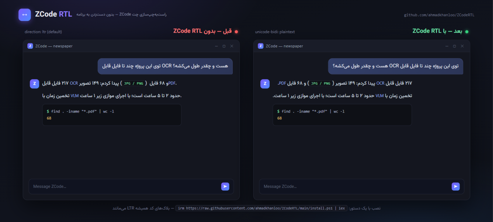

# ‏ZCode RTL 🇮🇷

<p align="center">
  
</p>

<div dir="rtl">

نسخهٔ انگلیسی: [README.md](README.md)

‏ابزار [ZCode](https://z.ai) — محیط برنامه‌نویسی هوش مصنوعی Z.ai — را وادار کنید چتش را **راست‌به‌چپ** نشان بدهد؛ برای فارسی و هر زبان راست‌به‌چپ دیگر.

‏ابزارهای هوش مصنوعی فرضشان انگلیسی است. ZCode همهٔ پیام‌ها را چپ‌به‌راست رندر می‌کند؛ نتیجه اینکه جواب‌های فارسی به‌هم‌ریخته دیده می‌شوند: نقطه و ویرگول می‌افتد سمت اشتباه و کلمات انگلیسی وسط جمله می‌پرند این‌ور و آن‌ور. **ZCode RTL این را با یک قانون CSS ساده و تزریق در زمان اجرا حل می‌کند — بدون اینکه حتی یک فایل از خود برنامه دست بخورد.**

## ✨ چه چیزی می‌گیرید

- ‏**RTL خودکارِ هر پاراگراف** — جهت هر بلاک از اولین حرف قوی آن تشخیص داده می‌شود: فارسی → راست‌به‌چپ، انگلیسی → چپ‌به‌راست؛ حتی داخل یک پیام
- ‏**متن ترکیبی درست** — پاراگراف‌های فارسی که کلمهٔ انگلیسی، عدد یا مسیر فایل دارند خوانا می‌مانند
- ‏**بلاک‌های کد چپ‌به‌راست می‌مانند** — ‏`pre` و `code` عمداً مستثنا شده‌اند
- ‏**باکس تایپ هم** — هنگام نوشتن، جهتش خودکار عوض می‌شود
- ‏**خودترمیم** — بعد از رفرش صفحه و در پنجره‌های جدید دوباره خودکار تزریق می‌شود
- ‏**نامرئی** — مخفی در پس‌زمینه اجرا می‌شود؛ بدون پنجرهٔ کنسول و بدون آیتم در تسک‌بار
- ‏**سبک و تک‌نمونه** — هر ۲ ثانیه یک درخواست محلی و چند مگابایت رم؛ اجرای دوبله خودش بسته می‌شود

## 🆚 چرا پچ نکنیم و تمام؟

| روش | مشکل |
|---|---|
| ‏پچ‌کردن `app.asar` | با **هر آپدیت برنامه** می‌شکند، نیاز به **دسترسی ادمین** دارد و می‌تواند نصب را خراب کند |
| ‏تزریق CSS با DevTools به‌صورت دستی | با **هر رفرش یا ری‌استارت** می‌پرد |
| ‏کپی‌کردن جواب‌ها جای دیگر برای خواندن | هر بار از جریان کارت خارج می‌شوی |
| ‏انتظار برای پشتیبانی رسمی RTL | 🙂 |

‏ZCode RTL **هیچ فایلی از برنامه را تغییر نمی‌دهد**: از پورت DevTools خود کرومیومِ برنامه استفاده می‌کند و یک استایل‌شیت در زمان اجرا تزریق می‌کند. آپدیت‌های برنامه اثری رویش ندارند، دسترسی ادمین نمی‌خواهد و حذفش یک دستور است.

## 🚀 نصب (یک روش را انتخاب کنید)

**یک دستور** — در PowerShell:

```powershell
irm https://raw.githubusercontent.com/ahmadkhanloo/ZCodeRTL/main/install.ps1 | iex
```

**یا** کلون و نصب:

```powershell
git clone https://github.com/ahmadkhanloo/ZCodeRTL.git
cd ZCodeRTL
powershell -ExecutionPolicy Bypass -File install.ps1
```

**یا** زیپ را از [Releases](../../releases) بگیرید، باز کنید و `install.ps1` را اجرا کنید.

‏پیش‌نیازها: **ویندوز**، نصب‌بودن [ZCode](https://z.ai) و **Node.js نسخهٔ ۲۱ به بالا** (از WebSocket داخلی آن استفاده می‌کند).

## ▶️ استفاده

‏ZCode را کاملاً ببندید (از System Tray هم Exit بزنید) و بعد آن را با شورتکات جدید **ZCode RTL** روی دسکتاپ اجرا کنید. همین — از این به بعد پیام‌های فارسی راست‌به‌چپ دیده می‌شوند.

> ‏پورت دیباگ فقط وقتی وجود دارد که ZCode از طریق شورتکات اجرا شود؛ پس به‌جای آیکون معمولی از همین شورتکات استفاده کنید.

## 🧰 عیب‌یابی

- ‏**هنوز چپ‌به‌راست است؟** یعنی ZCode از آیکون معمولی باز شده. کاملاً ببندید و با **ZCode RTL** بازش کنید.
- ‏**قبلاً کار می‌کرد و بعد از آپدیت خراب شد؟** آپدیت‌کننده برنامه را بدون پورت بازکرده. همان راه‌حل: بستن کامل → اجرا با شورتکات.
- ‏**معلوم شود در حال اجراست؟** در Task Manager دنبال `node.exe` بگردید (همان injector مخفی).
- ‏**حذف نصب:** ‏`powershell -ExecutionPolicy Bypass -File install.ps1 -Uninstall` — شورتکات و نسخهٔ دانلودشده را پاک می‌کند.

## 🔒 نکتهٔ امنیتی

‏تا وقتی ZCode از طریق شورتکات اجرا شود، یک پورت DevTools روی `127.0.0.1:9222` باز است که **هر پردازهٔ محلی** می‌تواند به آن وصل شود. فقط روی localhost است، ولی روی سیستم‌های اشتراکی به یاد داشته باشید.

## ⚙️ چطور کار می‌کند

‏`ZCode-RTL.cmd` برنامه را با `--remote-debugging-port=9222` اجرا می‌کند و یک اسکریپت Node حدوداً صدخطی (`injector.mjs`) را بالا می‌آورد که از طریق پروتکل DevTools کرومیوم یک قانون CSS به همهٔ پنجره‌ها تزریق می‌کند:

```css
:is(p, li, h1, h2, h3, blockquote, td, textarea, ...) {
  unicode-bidi: plaintext; /* جهت = اولین حرف قوی */
  text-align: start;
}
```

‏`plaintext` به هر پاراگراف اجازه می‌دهد جهت خودش را انتخاب کند؛ پس یک پیام می‌تواند هم پاراگراف فارسی داشته باشد هم انگلیسی و هر دو درست نمایش داده شوند. بلاک‌های کد مستثنا هستند و چپ‌به‌راست می‌مانند.

## مجوز

[MIT](LICENSE)

</div>
